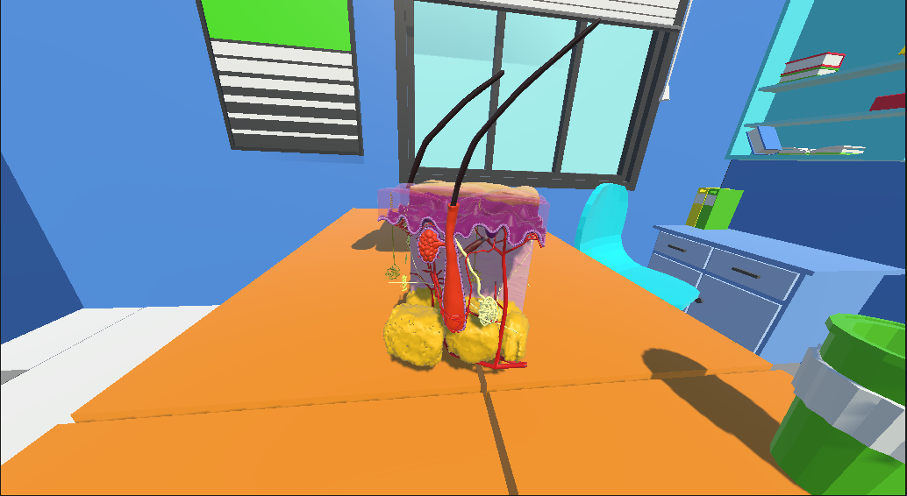
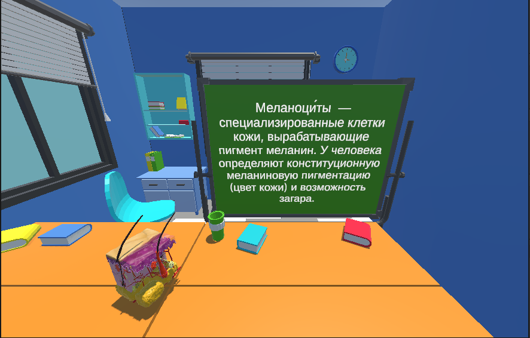
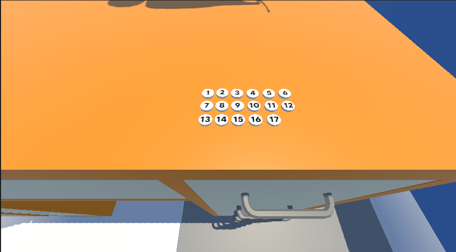

# VR-симулятор для изучения строения кожного покрова


> **Краткое описание:**  
> VR-симулятор для изучения строения кожного покрова — Иммерсивный обучающий симулятор, представляющий собой детализированную трехмерную диораму — увеличенный многослойный «вырез» (куб) кожного покрова человека. Проект позволяет детально и наглядно изучить топографию кожи, взаимное расположение тканей и внутренние процессы без необходимости использовать плоские схемы из учебников.



## Оглавление
1. [Цели и задачи проекта](#-цели-и-задачи-проекта)
2. [Структура проекта](#-структура-проекта)
3. [Используемые технологии](#-используемые-технологии)
4. [Интерфейс и процесс обучения](#-интерфейс-и-процесс-обучения)
5. [Схема управления (Ввод)](#-схема-управления-ввод)
6. [Установка и запуск проекта](#-установка-и-запуск-проекта)

## Цели и задачи проекта

* **Создать иммерсивное VR-приложение:** представляющее собой интерактивный трехмерный макет увеличенного среза кожи, для повышения наглядности и эффективности изучения анатомии и гистологии кожного покрова.
* **Демонстрация взаимодействий:** Реализация и наглядная демонстрация различных типов взаимодействий:
  * Визуализировать пространственную структуру: Продемонстрировать точное взаиморасположение слоев кожи (эпидермис, дерма, гиподерма) и ее придатков (железы, волосяные фолликулы, сосуды) в объеме.
  * Повысить вовлеченность учащихся: Заменить абстрактные двухмерные иллюстрации и схемы из учебников на интерактивный опыт, улучшающий запоминание материала.
  
  * Обеспечить безопасность и доступность: Предоставить детализированную альтернативу реальным микропрепаратам и дорогостоящим пластиковым моделям.



## Структура проекта

Для поддержания порядка в репозитории используется следующая иерархия папок:

```text
Assets          # Все игровые ресурсы
┣ Models        # 3D-модели интерактивных объектов 
┣ Prefabs       # Преднастроенные игровые объекты 
┣ Scenes        # Игровые сцены (главная сцена-песочница, тестовые сцены)
┣ Scripts       # Исходный код логики симулятора, физики и XR-взаимодействия
┗ UI            # Графические элементы интерфейса, меню настроек и подсказок
```


---

## 🔧 Используемые технологии и плагины

| Технология / Плагин | Версия | Назначение |
|---------------------|--------|------------|
| Unity Editor | 2022.3.53 LTS | Среда разработки |
| OpenXR | 1.1 | Базовый API для VR |
| XR Interaction Toolkit | 2.5 | Готовые решения для захвата, перемещения, взаимодействия |
| Unity Input System | 1.7 | Обработка ввода с контроллеров |
| TextMeshPro | 3.0.6 | Качественный текст в UI |
| (Опционально) SteamVR Plugin | 2.8 | Для поддержки Valve Index, HTC Vive |

---

## 🎮 Схема управления (ввод)

Управление стандартно для VR-контроллеров (совместимо с Oculus Touch, Valve Index, HTC Vive):

| Действие                | Кнопка / Жест                          |
|-------------------------|----------------------------------------|
| **Захват объекта**      | Grip (сжатие)                          |
| **Использование**       | Trigger (курок) — выстрел, натяжение, удар |
| **Перезарядка оружия**  | Кнопка B/Y (правая рука) или X/A (левая) |
| **Перемещение**         | Джойстик / тачпад (плавное движение или телепортация) |
| **Поворот**             | Поворот головы или джойстик (поворот на 45°) |
| **Меню / Пауза**        | Кнопка Menu (левая рука)               |
| **Настройки**           | Кнопка Menu (правая рука) + выбор в интерфейсе |

Все управления можно переназначить через `Input System` в Unity.

---

## 💻 Требования к системе и оборудованию

### Минимальные требования для ПК:
- **ОС**: Windows 10 64-bit
- **Процессор**: Intel Core i5-4590 / AMD Ryzen 5 1500X
- **ОЗУ**: 8 ГБ
- **Видеокарта**: NVIDIA GTX 1060 / AMD Radeon RX 480
- **VR-шлем**: с поддержкой OpenXR (Oculus Rift, HTC Vive, Valve Index и др.)

### Для Oculus Quest (Android):
- **ОС**: Android 10+
- **VR-шлем**: Oculus Quest / Quest 2 / Quest Pro
- **Объём хранилища**: не менее 1 ГБ свободного места

---

## 🛠 Установка и запуск

1. Cкачайте последний релиз(файл .APK)
2. Через софт (например SideQuest) установите APK-файл на VR-очки
3. Запустите и эксперементируйте с управлением!